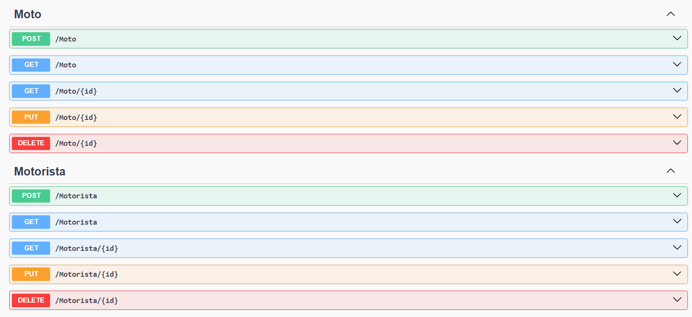

## Integrantes:

- Erick Alves - 556862
- Luiz Heimberg - 556864
- Vicenzo Massao - 554833

## Instruções de Execução:

- Adicionar credenciais em appsettings.json para conexão com Oracle database;

- Rodar Migrations (terminal): dotnet ef database update

- Rodar o Projeto, que irá abrir uma página no browser com o index do Swagger.

## Rotas:

## Techs:

- .NET SDK
- ASP.NET Core (8.0)
- Entity Framework Core (EF Core)
- AutoMapper
- Oracle Entity Framework Core Provider (Oracle.EntityFrameworkCore)
- Microsoft.AspNetCode.Mvc.NewtonsoftJson

## Desc:

Os três cavaleiros do Apocalipse, tem como objetivo auxiliar a empresa Mottu no problema de mapeamento das motos em seus pátios, onde usamos tecnologias IOT e um mapa interativo para mapear a região do pátio, além de poder separar por setores personalizados o próprio pátio.
